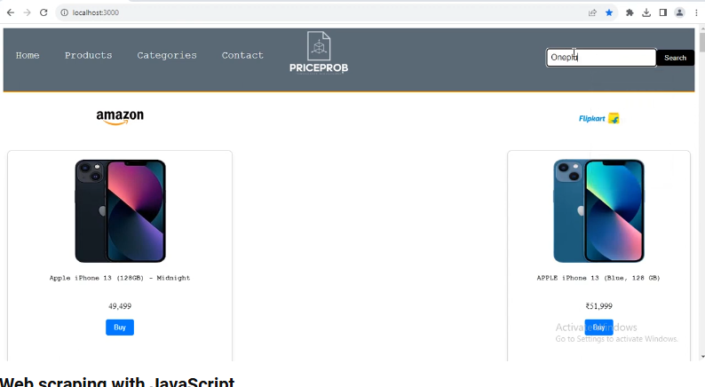

# Amazon Web Scraper (Node.js)

A Node.js-based web scraper to extract specific product details from Amazon's website. This tool allows you to scrape product data such as title, price, rating, and more from Amazon's search results.

 

## Features

- Scrape product details like title, price, description, ratings, etc.
- Search Amazon for specific products.
- Save scraped data into a JSON or CSV file.
- Easily extendable for other scraping needs.

## Prerequisites

Make sure you have the following installed on your machine:

- [Node.js](https://nodejs.org/) (v14+ recommended)
- npm or yarn (Package manager)

## Installation

1. **Clone the repository**:

```bash
git clone https://github.com/afsalabdurahman/amazon-web-scraper.git
cd amazon-web-scraper
